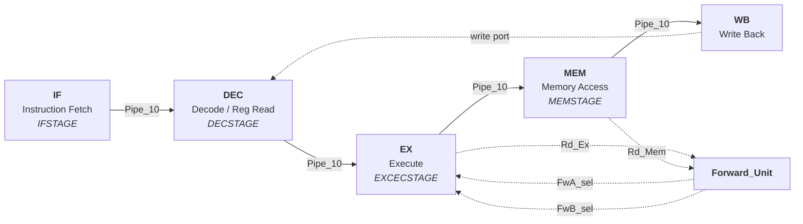

# Pipelined MIPS Processor — VHDL Implementation

A synthesizable 5-stage pipelined 32-bit MIPS processor written in VHDL, with a
full data-forwarding unit, hazard resolution, and a 1024-word memory subsystem.


---

## Table of Contents

- [Overview](#overview)
- [Pipeline Architecture](#pipeline-architecture)
- [Hazard Handling](#hazard-handling)
- [Module Reference](#module-reference)
- [Instruction Set](#instruction-set)
- [Build and Simulation](#build-and-simulation)
- [Repository Structure](#repository-structure)
- [License](#license)

---

## Overview

This project implements a MIPS-family processor as a classical five-stage pipeline.
The design is structural: a top-level `CPU` entity composes a control path and a data
path, each assembled from independently specified components, with pipeline registers
separating adjacent stages.

The engineering focus is **hazard resolution**. A naive pipeline stalls on every
read-after-write dependency; this implementation adds a dedicated forwarding unit that
routes results directly from the execute and memory stages back to the ALU inputs,
eliminating stalls for the common dependency cases.

| Property | Value |
|---|---|
| Data width | 32-bit |
| Register file | 32 × 32-bit, dual read port, single write port |
| Pipeline depth | 5 stages |
| Memory | 1024 words |
| Hazard strategy | Forwarding (EX→EX, MEM→EX) |
| Immediate handling | Dedicated sign/zero extender |

---

## Pipeline Architecture



**Stage responsibilities:**

| Stage | Module | Function |
|---|---|---|
| IF | `IFSTAGE` | PC maintenance, instruction fetch, PC increment via `Im_Adder` |
| DEC | `DECSTAGE` | Instruction decode, register-file read, immediate extension |
| EX | `EXCECSTAGE` | ALU operation, forwarding-multiplexer selection, branch comparison |
| MEM | `MEMSTAGE` | Data memory read/write against `RAM_1024` |
| WB | *(datapath)* | Result selection and register-file writeback |

Stages are separated by `Pipe_10` pipeline registers, which carry both data and the
control signals generated in decode forward to the stage that consumes them.

---

## Hazard Handling

### Data hazards

`Forward_Unit` compares the destination register of instructions currently in EX and
MEM against the source registers of the instruction entering EX:

```vhdl
entity Forward_Unit is
   Port (
       Rd_Ex   : in  STD_LOGIC_VECTOR (4 downto 0);   -- destination in EX
       Rd_Mem  : in  STD_LOGIC_VECTOR (4 downto 0);   -- destination in MEM
       Rs, Rt, Rd : in STD_LOGIC_VECTOR (4 downto 0); -- sources being decoded
       Op      : in  STD_LOGIC_VECTOR (5 downto 0);   -- opcode (operand relevance)
       FwA_sel : out STD_LOGIC_VECTOR (1 downto 0);   -- ALU operand A source
       FwB_sel : out STD_LOGIC_VECTOR (1 downto 0)    -- ALU operand B source
   );
end Forward_Unit;
```

On a match, `FwA_sel` / `FwB_sel` steer the ALU input multiplexers to take the live
result from EX or MEM instead of the stale register-file value. The opcode is an input
because which source registers are architecturally meaningful depends on instruction
format — forwarding on an unused operand field would produce spurious matches.

The dependency cases exercised by the test program are annotated in
[`assembly.asm`](assembly.asm):

```
add $1 , $3 , $2    Fw __ Data Hazard 1,2 cycles late __
add $3 , $5 , $3    Fw __ Data Hazard 1 cycle late __
```

### Control hazards

`Compare_Module` evaluates branch conditions, resolving the branch decision early
enough to limit the misprediction penalty rather than deferring it to the memory stage.

---

## Module Reference

### Top level

| Module | Role |
|---|---|
| `CPU` | Top entity — clock and reset only; composes control path and data path |
| `CONTROLPATH` | Instruction decode to control signals |
| `DTPATH1` | Data path — stage interconnect and register wiring |

### Pipeline stages

| Module | Role |
|---|---|
| `IFSTAGE` | Instruction fetch, program counter |
| `DECSTAGE` | Decode, register read, immediate extension |
| `EXCECSTAGE` | Execute — ALU and forwarding multiplexers |
| `MEMSTAGE` | Data memory interface |
| `Pipe_10` | Inter-stage pipeline register |

### Functional units

| Module | Role |
|---|---|
| `ALU` | Arithmetic and logic operations |
| `Forward_Unit` | Data-hazard detection and forward-path selection |
| `Compare_Module` | Branch condition evaluation |
| `Im_Adder` | PC increment / branch target computation |
| `Extender` | Sign and zero extension of immediates |

### Storage

| Module | Role |
|---|---|
| `Register_File` | 32 × 32-bit architectural registers |
| `Register_Module` | Single addressable register |
| `RAM_1024` | 1024-word data memory |

### Combinational primitives

| Module | Role |
|---|---|
| `Mux_2x1` | 32-bit 2:1 multiplexer |
| `MUX_2x1_5Bit` | 5-bit 2:1 multiplexer (register addresses) |
| `Mux_3x1_32` | 3:1 multiplexer — forwarding path selection |
| `Mux_32x1` | 32:1 multiplexer — register-file read port |
| `Dec_5x32` | 5-to-32 decoder — register write enable |

---

## Instruction Set

The supported subset, with encodings, is in [`assembly.asm`](assembly.asm) alongside
the machine code each line assembles to:

| Instruction | Opcode | Form |
|---|---|---|
| `li` | `111000` | Load immediate |
| `add` | `100000` | Register-register addition |
| `lw` | `001111` | Load word |
| `sw` | `011111` | Store word |

Example, with the binary encoding given beneath each mnemonic:

```asm
li 6 , $1
111000 00000 00001 0000000000000110

add $1 , $3 , $2
100000 00001 00011 00010 00000110000
```

---

## Build and Simulation

The design targets a Xilinx toolchain (the source headers are ISE-generated), but the
VHDL is vendor-neutral IEEE-1164 and simulates under any standard-compliant simulator.

**Xilinx ISE / Vivado**

1. Create a project targeting your device.
2. Add all sources from [`code/`](code/).
3. Set `CPU` as the top-level entity.
4. Synthesize, then simulate with a clock driving `Clk` and an initial `Rst` pulse.

**GHDL**

```bash
ghdl -a code/*.vhd
ghdl -e CPU
ghdl -r CPU --vcd=cpu.vcd
```

`CPU` exposes only `Clk` and `Rst`; program and data memory are initialized inside the
memory modules, so a testbench needs to supply nothing but clock and reset.

Design rationale, stage-by-stage timing analysis, and hazard-case walkthroughs are in
[`prj3_report.pdf`](prj3_report.pdf).

---

## Repository Structure

```
.
├── code/                    # 21 VHDL source files
│   ├── CPU.vhd              # Top-level entity
│   ├── CONTROLPATH.vhd      # Control signal generation
│   ├── DTPATH1.vhd          # Data path interconnect
│   ├── IFSTAGE.vhd          # Pipeline stages
│   ├── DECSTAGE.vhd
│   ├── EXCECSTAGE.vhd
│   ├── MEMSTAGE.vhd
│   ├── Pipe_10.vhd          # Inter-stage register
│   ├── Forward_Unit.vhd     # Hazard forwarding
│   ├── Compare_Module.vhd   # Branch resolution
│   ├── ALU.vhd
│   ├── Register_File.vhd
│   ├── RAM_1024.vhd
│   └── ...                  # Multiplexers, decoder, extender, adder
├── assembly.asm             # Test program with hazard annotations
└── prj3_report.pdf          # Design report and analysis
```

---

## License

Released under the [MIT License](LICENSE).
